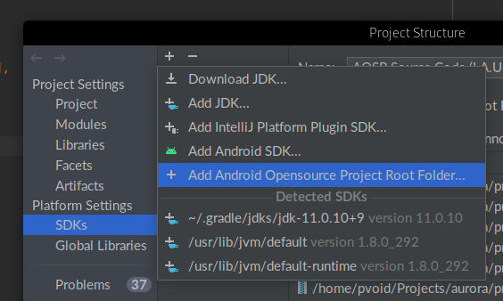

IntelliJ IDEA has great support for android apps development, but it is based on gradle. If you are developing 
your forked version of android it doesn't really help and even if you try to mock a gradle based project it 
will still use public versions of android.jar. It means that the system and hidden API won't be visible. It 
causes autocompletion and code inspection problems. 

This plugin intended to solve it. It uses blueprints as a base to build project structure and resolve dependencies.

### Usage

To use the plugin you need to create Android SDK first. Any SDK works. It's used mainly for rendering resources in
edit mode.


Next step - select Android source code root folder



The plugin is looking for `.repo` folder in the specified AOSP source code folder. If your workflow doesn't require it 
you can mock it. Just create an empty `.repo` folder and a minimal `manifest.xml` in it. The only required content is:

```xml
<?xml version="1.0" encoding="UTF-8"?>
<manifest>
   <default remote="caf" revision="LA.UM.8.6.2.r1"/>
</manifest> 
```

Now the plugin is ready to use. Just open any folder with `Android.bp` file in the root folder. You will see popup 
which asks you if you want to configure the project:


It will configure SDK and add dependencies.

##### Important

Plugin uses build output to index dependencies, so you need at least one successful build. 